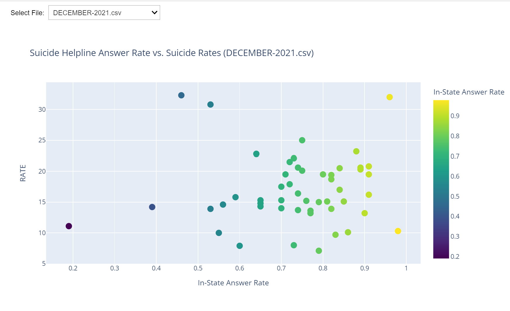
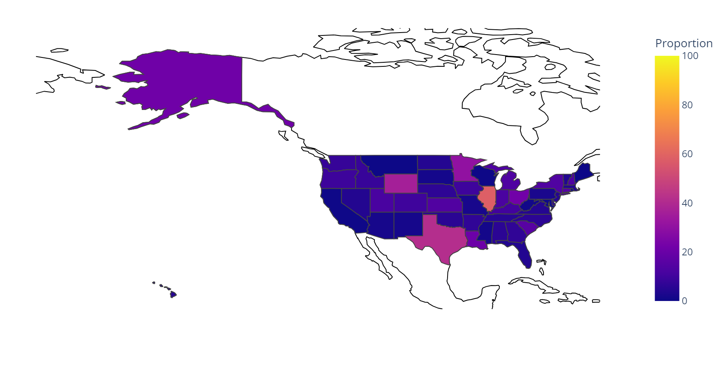

# Dialing Hope: Examining the 988 Suicide Helpline in the United States

---

## Introduction

This project, titled "Dialing Hope," examines the data of 988 Suicide Helpline in the United States. The project analyzes various datasets related to suicide rates, call center statistics, 
and other relevant data to gain insights into the effectiveness and impact of the 988 helpline. The goal is to understand the benefits and pitfalls of this system and its implications for 
mental health support in the United States.

## Datasets

1. [988Lifeline](https://988lifeline.org/our-network/)
2. [Global Data Lab](https://globaldatalab.org/shdi/table/shdi/USA/)

---

## Project Overview

### Mental Health in the US and the 988 Line

The project begins by addressing the mental health crisis in the United States and the need for an intervention like the 988 helpline. It discusses the impact of declining mental health on 
American society, particularly on marginalized communities.

### Suicide Rate Analysis for 2021 and 2022

The project includes visualizations and analyses of suicide rates in the United States for the years 2021 and 2022. It identifies states with the highest and lowest suicide rates and presents 
the data in an informative way.  

### States-wise HDI vs Suicide Rates

This section explores the relationship between Human Development Index (HDI) and suicide rates in different states. It uses a bubble plot to visualize the data.  

### Suicide Helpline Answer Rates vs Suicide Rates

This section examines the answer rates of the suicide helpline and their correlation with suicide rates. It includes interactive widgets for exploring this relationship on a month-by-month basis.  

### ASA vs Abandoned Calls

This section analyzes Average Speed of Answer (ASA) and abandoned call statistics. It visualizes the relationship between these metrics using scatter plots.  

### Talktime vs Number of Calls

The project investigates the relationship between talk time and the number of calls received. It includes statistics and scatter plots to help understand this relationship.  

### States-wise Backup Calls

This section explores the number of backup calls in different states. It includes choropleth maps to visualize backup call data.  

### States-wise Talktime Month by Month

The project analyzes talk time month by month and visualizes it on a map. It allows users to select a specific month for analysis.  

### Proportional Map of Received Calls to Backup

This section provides a proportional map showing the percentage of received calls that go to backup. It visualizes this data on a map for different datasets.  

### Biplot of ASA vs Backup Calls

The project includes biplots to analyze the relationship between Average Speed of Answer (ASA) and backup calls, helping to identify any patterns or correlations.

---

## Usage

To use this project, follow these steps:

1. Clone the repository to your local machine.
2. Install the required Python libraries (Pandas, Plotly, Folium, Geopy, ipywidgets).
3. Run the Python scripts provided in the repository.
4. Use the interactive widgets and visualizations to explore the data and gain insights into the 988 Suicide Helpline in the United States.

---

## Conclusion

"Dialing Hope" is a comprehensive project that analyzes various aspects of the 988 Suicide Helpline in the United States. It provides valuable insights into suicide rates, call center statistics,
and their relationships. This project aims to contribute to a better understanding of mental health support systems and their impact on society.
---
## Future Improvements

Here are some ideas for future improvements and features that can be added to this project:

- **Name of State:** In each of the result, the names of the State comes only when hover over that respective points, but if the name of top and bottom performing state renders automatically without manually hovering that point, it would make analysis much easier.

We welcome contributions and ideas from the community. If you have suggestions or would like to work on any of these improvements, please open an issue or submit a pull request.

---

## License

This project is licensed under the [MIT License](LICENSE).
